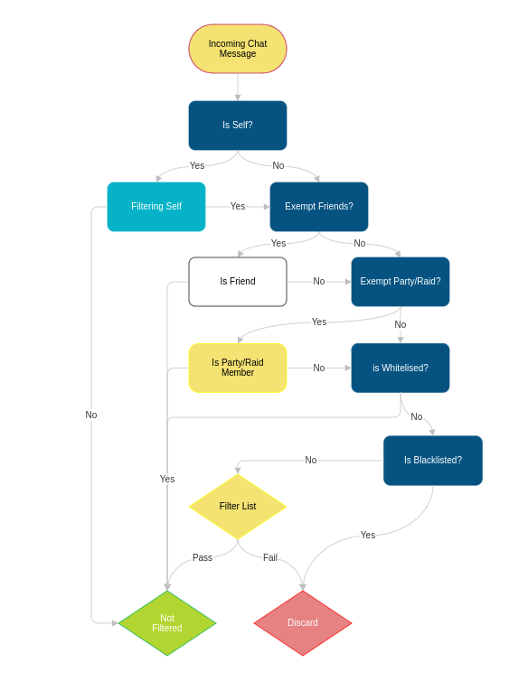

## A Simple World of Warcraft Spam Filter!
_Please help localize this project [HERE](http://www.wowace.com/projects/trade-filter/localization/)_

TradeFilter does not only filter Trade Chat but has the ability to filter General, LookingforGroup, Say and Yell channels all which are configurable through the blizzard options panel.

### Channel Filters
TradeFilter has a set of patterns for trade channel and separate set of patterns for all other channels, or "base" channels. This allows the user to define what patterns may be good for trade but not other channels and vise versa. The user also has the ability to add patterns of their own to be matched against for both trade and "base" channel filters.

### Black and White Lists
TradeFilter also has a built in Black and White list. Refer to the Flowchart for how Black and White lists are checked.


### Configuration
```
/tf or /filter
```

#### ChangeLog
[ChangeLog Page](https://github.com/Evonder/TradeFilter/commits/master)

#### Supported Translations
_Please help localize this project [HERE](http://www.wowace.com/projects/trade-filter/localization/)_
